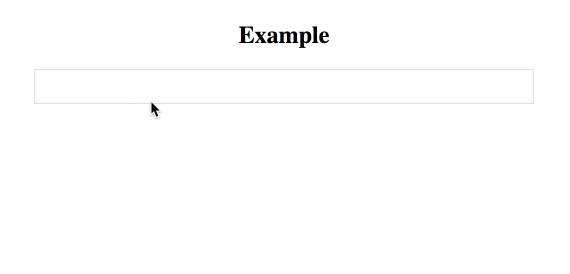

# Ngx-Smart-AutoComplete

[](https://travis-ci.org/kuroky360/ngx-smart-autocomplete) [](https://www.npmjs.com/package/ng2-smart-autocomplete)  [](https://www.npmjs.com/package/ng2-smart-autocomplete) [](https://www.npmjs.com/package/ng2-smart-autocomplete)




## What is ngx-smart-autocomplete?
   ngx-smart-autocomplete is a Angular Library which allows the visitor to select an item from a Real-time pull dropdown list when typing something into an input field. Similar to the autocomplete, typeahead and tags input plugins.

## Features
  * Lightweight
  * Tag input
  * Keyboard shortcuts
  * Dynamic drop-down lists 

## Install

```sh
 $ npm install ngx-smart-autocomplete --save
```

## Usage
  
  1、import NgxSmartAutocompleteModule to your AppModule
  
  ```sh
   import { NgxSmartAutocompleteModule } from 'ngx-smart-autocomplete';
   
   @NgModule({
     declarations: [
       AppComponent
     ],
     imports: [
       BrowserModule,
       NgxSmartAutocompleteModule
     ],
     providers: [],
     bootstrap: [AppComponent]
   })
   export class AppModule { }
  ```  
  
  2、use it in your template
  
    <smart-autocomplete [displayData]="myDisplayData" [fetchData]="myFetchData" (fetchMethod)="myFetchMethod($event)"></smart-autocomplete>

## Attributes

| @Input()/@Output()       | Type                 | Required | Default  | Description                                                                                                                                                                                                                                                                                           |
| ------------------------ | -------------------- | -------- | -------- | ----------------------------------------------------------------------------------------------------------------------------------------------------------------------------------------------------------------------------------------------------------------------------------------------------- |
| displayData              | array                | required | []       | Used to save the currently selected data list. Expect such a data format  [ {id:'xx',name:'xx'},... ]                                                                                                                                                                                                 |
| fetchData                | array                | required | []       | Data source array,used to save the current real-time pull data list. Expect such a data format [ {id:'xx',name:'xx'},... ]                                                                                                                                                                            |
| maxCount                 | number               | optional | unlimited| The maximum number of selected data lists, the default number is unlimited.                                                                                                                                                                                                                           |
| en                       | boolean              | optional | false    | If true, the English template is used, otherwise the Chinese template is used, the default is false.                                                                                                                                                                                                  |         
| fetchMethod              | fn                   | required | -        | Real-time data pull method, receiving a keyword parameter（$event）(It should be noted that **`fetchData`** should be updated after the data is obtained)                                                                                                                                              |                        
## For Developers

  ```sh
  $ git clone https://github.com/kuroky360/ngx-smart-autocomplete.git
  $ cd ngx-smart-autocomplete
  $ npm install
  $ npm start
  ```
### List of available npm tasks

   * `npm run package` : build and package project
